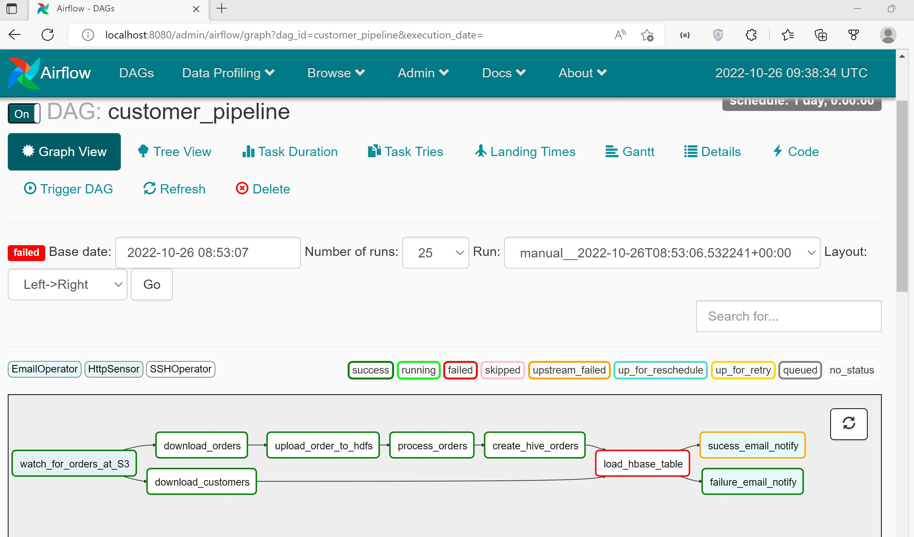

### Pipeline implementation with Amazon S3,Hive,Hbase, Spark,Airflow and Gmail

Pipleine involves 
Checking if the orders file is available in the S3 bucket
Once the file is available , we are fetching the file from the Amazon S3 bucket tp the edge node

sqoop command to fetch the customers(complete dump at once no incremental load and non partitioned) from sql to the hive

  

