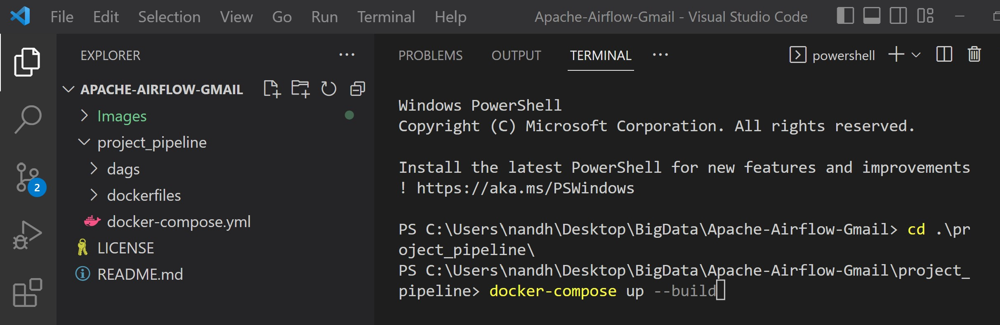
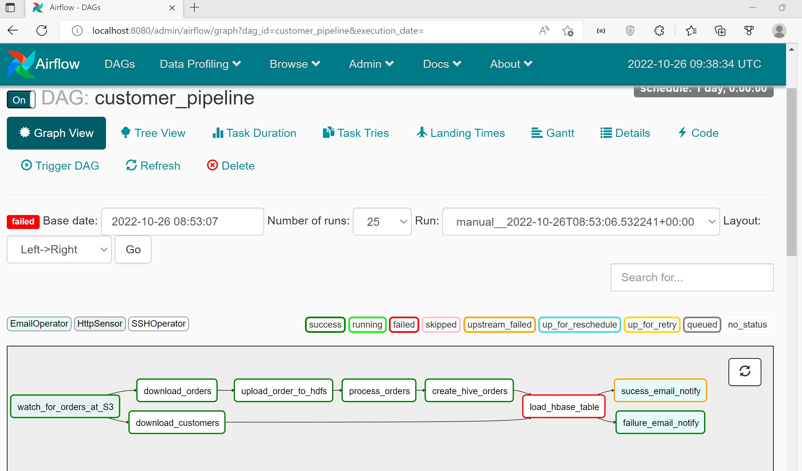

# Pipeline implementation with Amazon S3,Hive,Hbase, Spark,Airflow and Gmail

## Pipleine involves the below steps 

Step1: Checking if the orders file is available in the S3 bucket

Step2: Once the file is available , we are fetching the file from the Amazon S3 bucket tp the edge node

Step3: Sqoop command to fetch the customers(complete dump at once no incremental load and non partitioned) from sql to the hive

  

  

  

