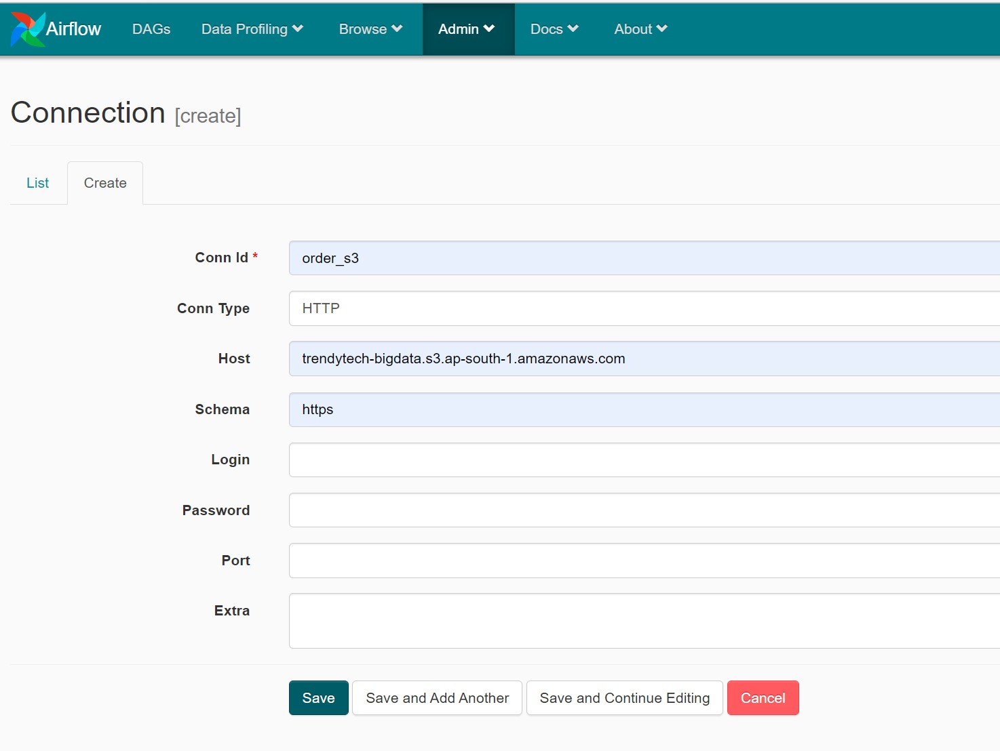

# Pipeline implementation with Amazon S3,Hive,Hbase, Spark,Airflow & Gmail for notifications

## List of components used for the pipeline implementation 
### VSCode Editor
### Docker 
### Itversity Lab for distributed environment
### Amazon S3
### Sqoop
### Hive
### Spark
### HBase
### Airflow
### Gmail SMTP Server 

## Pipleine implementation involves the below steps 

Step1: Checking if the orders file is available in the S3 bucket

Step2: Once the file is available , we are fetching the file from the Amazon S3 bucket to the edge node

Step3: Sqoop command to fetch the customers(complete dump at once no incremental load and non partitioned) from sql to the hive

Step4: Upload the orders.csv file from the edge node to the HDFS location

Step5: Spark submit 

Step6: Create hive table from the Spark output 

Step7: Create Hbase TABLE

## Prerequisites

 Please make sure Docker Desktop is installed and up on running 

## Steps to be followed for viewing the DAG in Airflow

Step1: Download the repo to your local system and open it in VSCode.

Step2: Edit the docker-compose.yml file and mention your Gmail SMTP Server credentials. It's different from your gmail account credentials.
       You can remove all the parameters mentioned as "AIRFLOW_SMTP_SMTP_" , if you want to skip the gmail notification part .
  
  

  

     

Step3: Please make sure docker desktop is up on running . Open terminal in VSCode and change the directory to project_pipeline
       and execute the  "docker-compose up --build" .

  

Step3: You would be getting the below message showing AIRFLOW which indicates that the Airflow is up on running

  

Step4: Open the tab with localhost:8080 where you can view the below broken DAG 

  

Step5: You need to configure the new connections as mentioned below in the below screenshots

### One for the order_s3

  

### Second for the itversity

  

Step6: You have to define the pool with name "my_pool" as mentioned in the default_args. 

  

Step7: If you have followed the above mentioned steps , then you would be viewing the below DAG image 

  

Step8: Click on the "OFF" option and change it to "ON" to turn on the DAG customer_pipeline

  

Step9: Once the steps mentioned in the pipeline is completed then you would be receiving the mail notifications to your gmail account.

### For Success Scenario

  

    
  ### For Success mail notification 
    

  

### For Failure Scenario

  

   
   ### For Failure mail notification 
   

  

